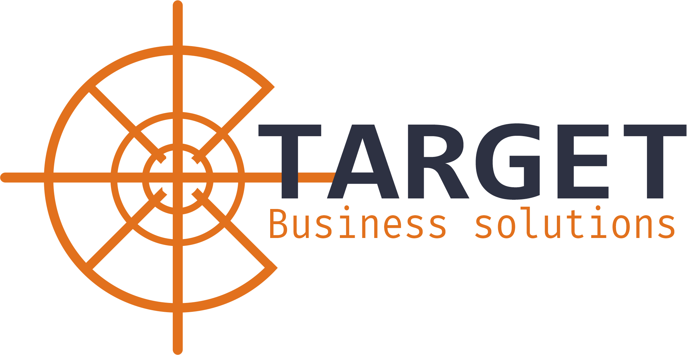
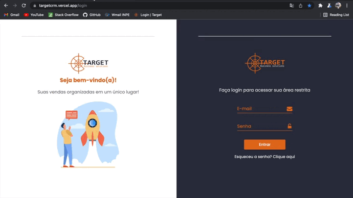
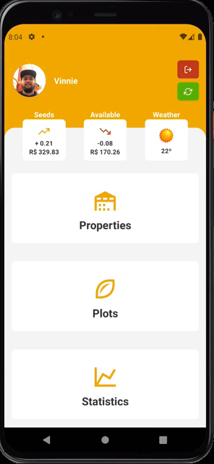
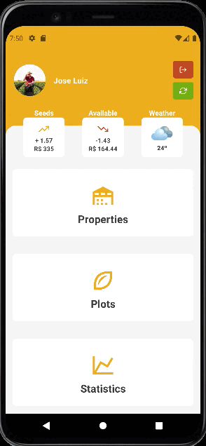
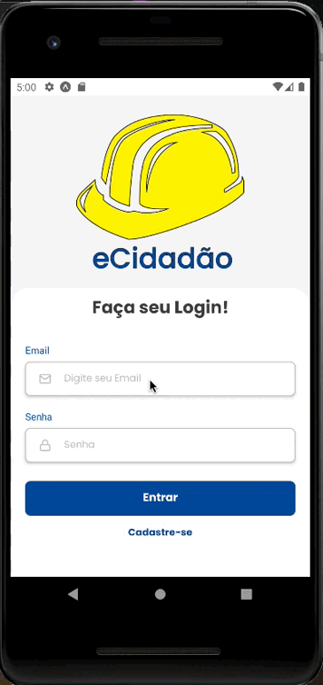
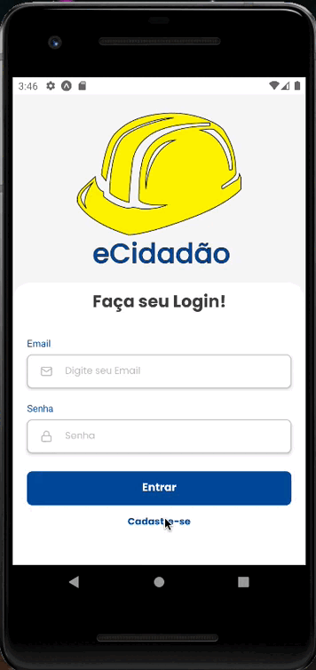
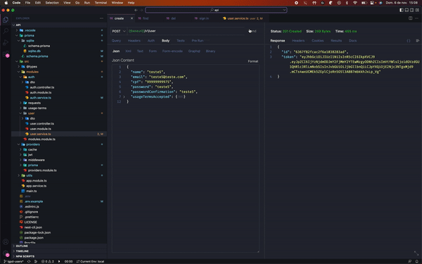
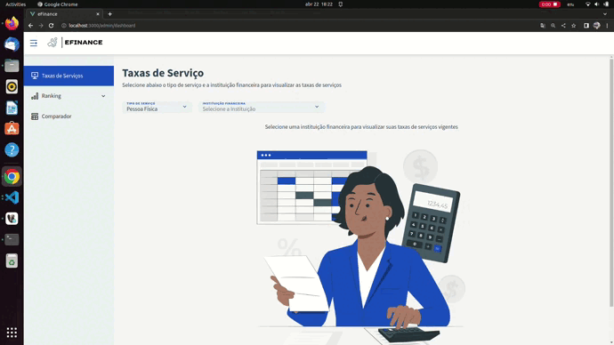
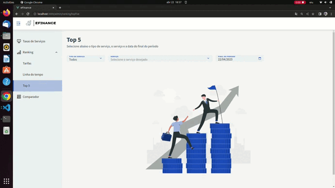

# __*__Hariel Thums Rigelli__*__

## Introdução

Estou cursando Análise e Desenvolvimento de Sistemas na Fatec/SJC, atuo atualmente como Desenvolvedor Backend (Node.js | NestJS | TypeScript | MySQL) e antes disso tive uma passagem breve como Desenvolvedor fullstack Jr. (Angular | Node.js | TypeScript | MongoDB). Entrei no mercado de desenvolvimento no meu segundo semestre na Fatec, e desde então venho evoluindo e buscando mostrar meu trabalho!

Publiquei uma biblioteca open source ([Link](https://www.npmjs.com/package/nestjs-prisma-querybuilder)), que foi criada com o objetivo de auxiliar outros desenvolvedores e outros projetos. Foi uma realização muito gratificante e sinto que foi uma pequena forma de retribuir tudo que a comunidade faz por nós desenvolvedores.

## Meus Projetos

### Em 2020-2 - *__Elite Academy__*

- __Primeiro semestre__

#### ***[Link do Github](https://github.com/HarielThums/ProjetoIntegrador01)***

#### __Parceiro__

- O parceiro neste projeto foi a Faculdade de Tecnologia de São José dos Campos - Prof. Jessen Vidal, fazendo o papel de cliente tivemos o Prof. Antonio Egydio.

#### __Problema e solução__

- O cliente desejava vender atraves de um e-commerce conteúdos acadêmicos voltados para a área de técnologia com livros, pdfs e vídeo aulas. Como solução foi criado o site Elite Academy os clientes poderiam visualizar em listas os conteúdos disponiveis alem de eventuais promoções disponiveis e em caso de interesse se cadastrar e fazer a compra desses materiais.

#### Tecnologias Utilizadas

- HTML
  - Linguagem de marcação utilizada na construção das páginas;
- CSS
  - Linguagem de estilização utilizada para dar estilo as páginas;
- WordPress
  - Utilizado para dar efeito dinâmico e definir as ações tanto no lado do cliente quanto no lado do administrador (painel do admin).

#### Contribuições Pessoais

- Fui responsável por fazer a parte lógica do WordPress, gerenciamento dos plugins, configurações e painel de administrador, upload dos conteúdos (vídeos, pdfs e livros), navegação entre as págianas e autenticação do usuário.
- Fui responsável pela parte de criação das telas e da estilização seguindo os requisitos do cliente, buscando entregar uma interface simples e elegante.

#### Hard Skills

- Wordpress
  - Sei fazer com autonomia;
- HTML
  - Sei fazer com autonomia;
- CSS
  - Sei fazer com ajuda;

#### Soft Skills

- Trabalho em equipe
  - Fomos colocados em situações de pressão e o trabalho em equipe e colaboração com o time nos permitiu entregar um produto de maior qualidade.
- Colaboração
  - Pude auxiliar e me desenvolver juntamente com meus colegas, dando juntos os primeiros passos nas tecnologias utilizadas nesse projeto.

### Em 2021-1 - *__GSWatcher__*

- __Segundo semestre__

#### ***[Link do Github](https://github.com/vinicius-hso/api-fatec-2s-gswatcher)***

#### __Parceiro__

- O parceiro neste projeto foi a empresa [GSW](https://www.gsw.com.br/) que atua a mais de 29 anos na área de desenvolvimento de softwares, especializada em gerar soluções para o gerenciamento, controle de processos e negócios.

#### __Problema e solução__

- O problema proposto foi de desenvolver uma solução que unifique e trate os dados gerados pelos atuais sistemas de gerenciamento de projetos da empresa e apresente as informações da base de dados em um Dashboard para o acompanhamento do desenvolvimento dos projetos. A solução proposta foca em aproximar Diretores e projetos, proporcionando uma visão mais detalhada e atualizada do que está realmente acontecendo, fornecendo insights baseados em dados reais sobre seus projetos e facilitando a tomada de decisões. Através de uma Aplicação Web oferecemos a visualização de informações em forma de gráficos a respeito de seus projetos.

#### Tecnologias Utilizadas

- Frontend
  - HTML/CSS/JavaScript
  - Vue.js
- Backend
  - Node.js
  - JavaScript
- Database
  - PostgresSQL

#### Contribuições Pessoais

- Fui responsável por fazer a parte do backend do produto, estruturando e gerenciando as rotas, middleware de autenticação, queries para o banco de dados (neste projeto não foi utilizado um ORM, as queries foram feitas com o drive nativo do Postgres),
- Fui responsável por fazer a modelagem e implementação do banco de dados, estruturando e criando as tabelas.
- Fui responsável por implementar e configurar o serviço de envio de email (utilizando o nodemailer).
- Fui responsável pelo gerenciamento e manutenção do deploy e ambiente de produção.

#### Hard Skills

- Node.js
  - Sei fazer com autonomia.
- JavaScript
  - Sei utilizar com autonomia
- PostgresSQL
  - Sei utilizar com autonomia.

#### Soft Skills

- Trabalho em equipe
  - Neste projeto tivemos que nos aprodundar mais em conhecimentos técnicos e o trabalho em equipe nos proporcionou maior agilidade e entendimento dos problemas e soluções desenvolvidos.
- Colaboração
  - Tivemos sessões de pair programming onde trabalhavamos juntos, tentando solucionar os problemas e auxiliarmos uns ao outros na solidificação dos conhecimentos.

### Em 2021-2 - *__Target CRM__*

- __Terceiro semestre__

#### ***[Link do Github](https://github.com/HarielThums/api-sem3-target-crm)***

#### __Parceiro__

- O parceiro neste projeto foi a empresa [Ionic Health](https://pt-br.ionic.health/) empresa especializada em inovação e transformação digital para a saúde. Desenvolvendo soluções que automatizam, monitoram e teleoperam equipamentos clínicos.

#### __Problema e solução__

- O problema proposto foi de desenvolver uma Aplicação Web de Customer Relationship Management (Gestão de Relacionamento com o Cliente) para organização dos processos comerciais, oferecendo suporte adequado às áreas de vendas e negócios para a empresa parceira. A solução proposta foi a de uma aplicação capaz de organizar e editar os contatos, relizar cadastros e gestão das pipelines, cadastro e gestão das negociações, monitoramento e acompanhamento de clientes, importação de contatos via excel e exibir todos esses dados em um dashboard.

#### Tecnologias Utilizadas

- Frontend
  - React
  - Next.js
  - TypeScript
  - HTML/CSS
- Backend
  - Node.js
  - TypeScript
  - TypeORM
  - Docker
  - Jest
- Database
  - PostgresSQL

#### Contribuições Pessoais

- Fui responsável por construir o backend do produto, estruturando e gerenciando as rotas e regras de negócio, middleware de autenticação, middleware para controle de permissões, mapeamento do ORM (TypeORM) e migrations seguindo a modelagem, estruturando e criando as tabelas.
- Nos ambientes de desenvolvimento foi utilizado docker com objetivo de facilitar o run do time de desenvolvimento.
- Fui responsável pelo gerenciamento e manutenção do deploy e ambiente de produção.
- Fui responsável pela criação dos testes de integração realizados (100% do backend foi testado).

#### Hard Skills

- Node.js
  - Sei fazer com autonomia.
- TypeScript
  - Sei utilizar com autonomia
- TypeORM
  - Sei utilizar com autonomia.
- PostgresSQL
  - Sei utilizar com autonomia.
- Jest
  - Sei utilizar com autonomia.

#### Soft Skills

- Trabalho em equipe
  - Neste projeto tivemos que nos aprodundar mais em conhecimentos técnicos e o trabalho em equipe nos proporcionou maior agilidade e entendimento dos problemas e soluções desenvolvidos.
- Colaboração
  - Tivemos sessões de pair programming onde trabalhavamos juntos, tentando solucionar os problemas e auxiliarmos uns ao outros na solidificação dos conhecimentos.

### Em 2022-1 - *__eSoja__*

- __Quarto semestre__

#### ***[Link do Github](https://github.com/cluster-8/esoja-mobile)***

#### __Parceiro__

- O parceiro neste projeto foi a empresa [Visiona Tecnologia Espacial](https://www.visionaespacial.com.br/) empresavoltada para a integração de sistemas espaciais. Criada em 2012 para atender os objetivos do Programa Nacional de Atividades Espaciais e do Programa Estratégico de Sistemas Espaciais.

#### __Problema e solução__

- O desafio do projeto é criar um aplicativo colaborativo para produtores rurais e através desse aplicativo os usuários poderão incluir informações do dia a dia sobre sua plantação. Essas informações consistem em dados alfa-numéricos e fotos georreferenciadas pelo GPS do próprio celular. Com os dados de vários usuários, o aplicativo irá fornecer informações estatísticas sobre sua produção, podendo assim comparar com dados históricos de outros usuários.

#### Tecnologias Utilizadas

- Frontend
  - ReactNative
  - Expo
  - TypeScript
  - HTML/CSS
- Backend
  - Node.js
  - Nest.js
  - TypeScript
  - Prisma
  - Docker
- Database
  - PostgresSQL
  - Redis

#### Contribuições Pessoais

- Fui responsável por construir o backend do produto, estruturando e gerenciando as rotas e regras de negócio, serviço de envio de email, gerenciamento de filas (queue no envio de emails), middleware de autenticação, middleware para controle de permissões, mapeamento do ORM (Prisma), estruturando e criando as tabelas.
- Fui responsável pelo gerenciamento e manutenção do deploy e ambiente de produção.
- Fui responsável por fazer a integração do backend com API de terceiros (AGRITEC e IMEA, IBGE)

  #### 

Integrações
	

#### Hard Skills

- Node.js
  - Sei fazer com autonomia.
- Nest.js
  - Sei fazer com autonomia.
- TypeScript
  - Sei utilizar com autonomia
- Prisma
  - Sei utilizar com autonomia.
- PostgresSQL
  - Sei utilizar com autonomia.
- Redis
  - Sei utilizar com autonomia.

#### Soft Skills

- Pensamento analítico
  - Este projeto foi um desafio maior, então foi necessário pensamento analítico e comunicação desde a apresentação do tema até a entrega final do produto, levantando mais requisitos a cada sprint, proporcionando ao cliente um produto mais robusto e que superou as espectativas.
- Colaboração
  - Houveram momentos onde surgiam problemas mais complexos e tivemos que trabalhar juntos, tentando solucionar e entregar o melhor resultado possível.
- Criatividade
	- Tivemos como equipe que pensar de forma diferente na realização deste projeto, visto que foi uma temática nova e com maiores desafios, então foi necessário criatividade na resolução do problema e estruturação do produto.

	
	
	

### Em 2022-2 - *__eCidadao__*

- __Quinto semestre__

#### ***[Link do Github](https://github.com/cluster-8/eCidadao)***

#### __Parceiro__

- O parceiro neste projeto foi a Faculdade de Tecnologia de São José dos Campos - Prof. Jessen Vidal, fazendo o papel de cliente tivemos o Prof. Gerson Penha.

#### __Problema e solução__

- O desafio do projeto é criar um aplicativo colaborativo para a sociedade e através desse aplicativo os usuários poderão reportar "problemas" da cidade para a "prefeitura". Podendo tirar foto do problema, adicionar uma descrição, a localização do problema para que a prefeitura possa saber sobre o problema e ir consertá-lo.

#### Tecnologias Utilizadas

- Frontend
  - ReactNative
  - Expo
  - TypeScript
  - HTML/CSS
- Backend
  - Node.js
  - Nest.js
  - TypeScript
  - Prisma
- Database
  - MongoDB
  - Redis

#### Contribuições Pessoais

- Fui responsável por construir o backend do produto, estruturando e gerenciando as rotas e regras de negócio, middleware de autenticação, middleware para controle de permissões, mapeamento do ORM (Prisma), estruturando e criando as tabelas.
- Fui responsável pelo gerenciamento e manutenção do deploy e ambiente de produção.
- Fui responsável por fazer a integração do backend com API do Google 'Geocode'.
- Fui responsável pela implementação da criptografia dos dados de usuários e garantia de anonimato dos dados em caso de solicitação de deleção de conta pelo usuário.

#### Hard Skills

- Node.js
  - Sei fazer com autonomia.
- Nest.js
  - Sei fazer com autonomia.
- TypeScript
  - Sei utilizar com autonomia
- Prisma
  - Sei utilizar com autonomia.
- MongoDB
  - Sei utilizar com autonomia.
- Redis
  - Sei utilizar com autonomia.

#### Soft Skills

- Pensamento analítico
  - Este projeto foi um desafio maior, então foi necessário pensamento analítico e comunicação desde a apresentação do tema até a entrega final do produto, levantando mais requisitos a cada sprint, proporcionando ao cliente um produto mais robusto e que superou as espectativas.
- Colaboração
  - Houveram momentos onde surgiam problemas mais complexos e tivemos que trabalhar juntos, tentando solucionar e entregar o melhor resultado possível.
- Criatividade
	- Tivemos como equipe que pensar de forma diferente na realização deste projeto, visto que foi uma temática nova e com maiores desafios, então foi necessário criatividade na resolução do problema e estruturação do produto.

	
	
	

### Em 2023-1 - *__eFinance__*

- __Sexto semestre__

#### ***[Link do Github](https://github.com/cluster-8/eFinance)***

#### __Parceiro__

- O parceiro neste projeto foi uma empresa do setor Financeiro que oferece soluções à corporações, governos e instituições, presente em mais de 100 países e com mais de 70 anos de mercado.

#### __Problema e solução__

- O desafio do projeto é criar um aplicativo colaborativo para a sociedade e através desse aplicativo os usuários poderão reportar "problemas" da cidade para a "prefeitura". Podendo tirar foto do problema, adicionar uma descrição, a localização do problema para que a prefeitura possa saber sobre o problema e ir consertá-lo.

#### Tecnologias Utilizadas

- Frontend
  - Vue.js
  - TypeScript
  - HTML/CSS
- Backend
  - Java
  - Spring boot
- Scrapper/AI
  - Python
- Database
  - PostgreSQL
  - Redis

#### Contribuições Pessoais

- Fui responsável por construir o backend do produto, estruturando e gerenciando as rotas e regras de negócio.
- Fui responsável por parte do mapeamento e desenvolvimento do SQL do produto.
- Fui responsável pelo gerenciamento e manutenção do deploy e ambiente de produção.
- Fui responsável por parte do Scapper dos dados das APIs do 'BCB'.

#### Hard Skills

- Java
  - Sei fazer com autonomia.
- Spring boot
  - Sei utilizar com autonomia.
- Python
  - Sei utilizar com autonomia
- PostgreSQL
  - Sei fazer com autonomia.
- Redis
  - Sei fazer com autonomia.

#### Soft Skills

- Determinação
  - Neste projeto tivemos que busca informações relevantes e que gerassem valor ao projeto, visto que os dados são de dominio público porem não estão disponíveis de forma fácil, sendo necessário uma grande pesquisa e tratamento dos mesmos antes de ser possível exibir na aplicação.
- Colaboração
  - Houveram momentos onde surgiam problemas mais complexos e tivemos que trabalhar juntos, tentando solucionar e entregar o melhor resultado possível.
- Criatividade
	- Tivemos como equipe que pensar de forma diferente na realização deste projeto, visto que foi uma temática nova e com diferentes desafios, então foi necessário criatividade na resolução do problema e desenvolvimemnto da estrutura do produto.

	
	
	

## Meus Principais Conhecimentos

Meus principais conhecimentos estão relacionados ao desenvolvimento Backend, área que atuo e que dedico meus estudos buscando me aprofundar e solidificar os conceitos e boas práticas cada vez mais.

Trabalho com Node.js utilizando o framework Nest.js, mas possuo experiência com os frameworks Express e Koa tambem, atualmente como banco de dados utilizo MySQL, Redis e Firebase (storage e firestore) e tenho conhecimentos em PostgresSQL e MongoDB.
Como ORMs estou trabalhando com o Prisma, este foi o ORM que me motivou a publicar a biblioteca Open source mencionada anteriormente ([LINK](https://www.npmjs.com/package/nestjs-prisma-querybuilder)) mas tambem possuo experiência com o TypeORM e Mongoose.

Já fiz algumas integrações com serviços de terceiros (Google (Geocode, analytics), envio de Email, envio de SMS, controle do Cloudflare, controle do Nginx e mais...), gerenciamento de relatórios (excel, pdf), controle de fila, jobs, middlewares, guards e implementação de regras de segurança.

Tenho experiência com testes de integração e unitários utilizando os frameworks Jest e Mocha do Node.js.

## Contatos

__Mídias sociais:__

[![[]](https://img.shields.io/badge/linkedin%20-%230077B5.svg?&style=for-the-badge&logo=linkedin&logoColor=white)](https://www.linkedin.com/in/hariel-thums/) [![[]](https://img.shields.io/badge/Facebook%20-%231877F2.svg?&style=for-the-badge&logo=Facebook&logoColor=white)](https://www.facebook.com/hariel.dtz)[![[]](https://img.shields.io/badge/gitlab-%23181717.svg?style=for-the-badge&logo=gitlab&logoColor=white)](https://gitlab.com/HarielThums)[![[]](https://img.shields.io/badge/gitlab-%23181717.svg?style=for-the-badge&logo=github&logoColor=white)](https://github.com/HarielThums)

__Fale comigo:__

- [![[]](https://img.shields.io/badge/WhatsApp-25D366?style=for-the-badge&logo=whatsapp&logoColor=white)](https://api.whatsapp.com/send?phone=5512996219221)
- [![[]](https://img.shields.io/badge/Gmail-D14836?style=for-the-badge&logo=gmail&logoColor=white)](mailto:hariel@hotmail.com)
